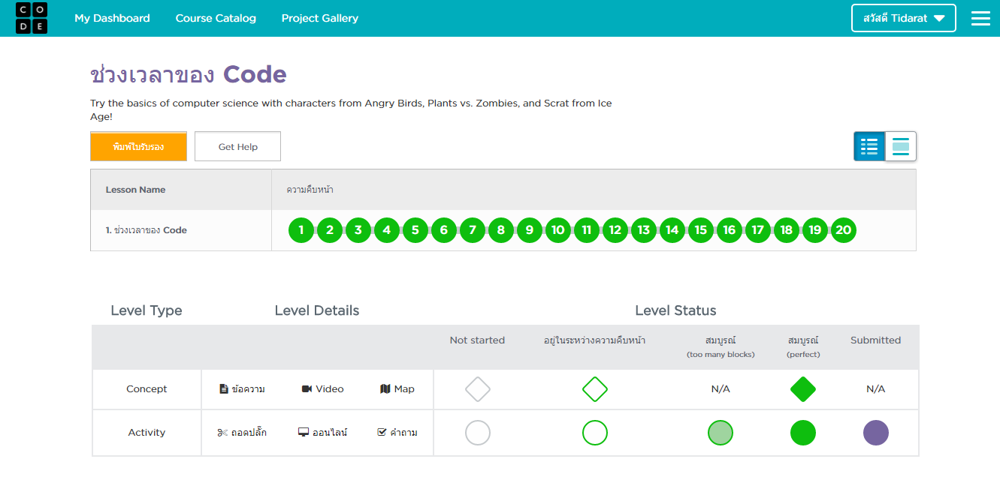
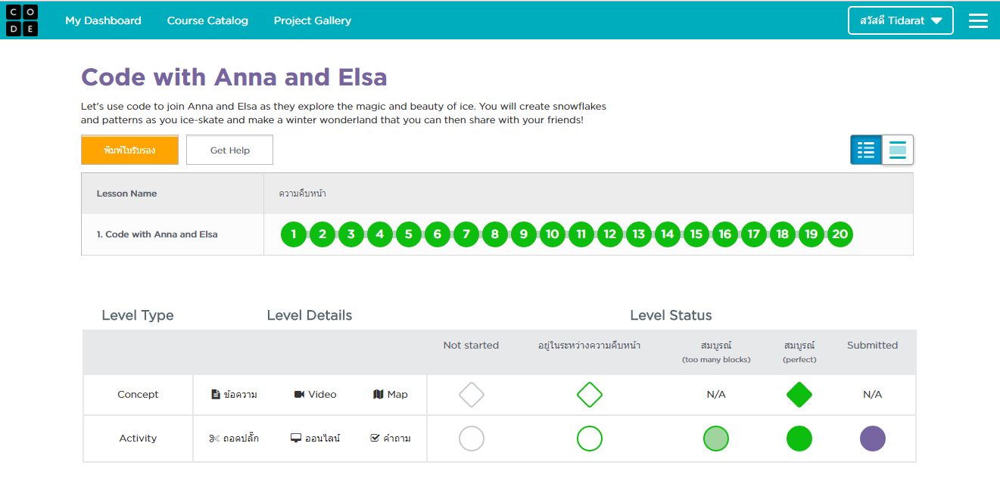
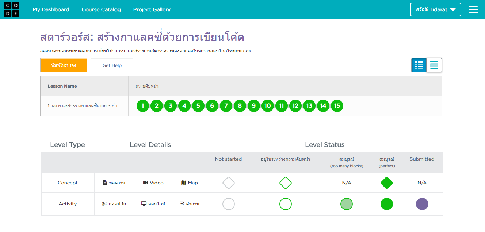
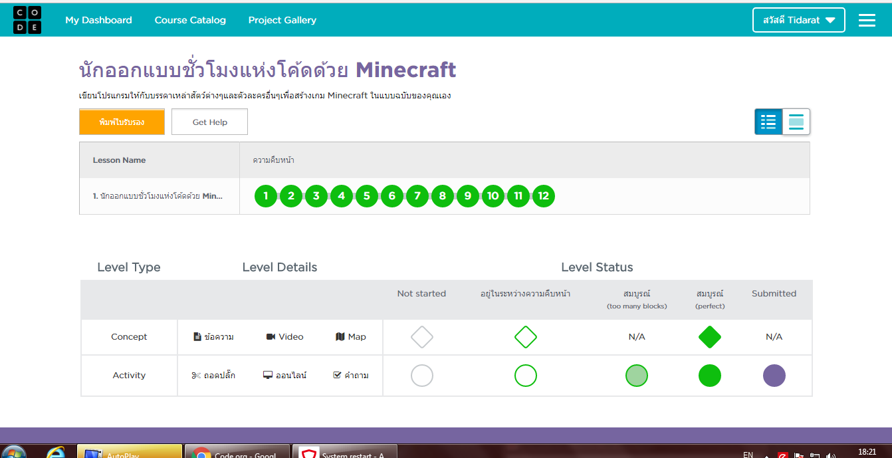

# tp_prog_week3
งานครั้งที่ 4 วิชาการเขียนโปรแกรมคอมพิวเตอร์ ปวส1

## วิธีการส่งงาน

1.  บันทึกหน้า dashboard ของแต่ละกิจกรรม
2.  **ตั้งชื่อตามนี้**
    -  Angry Bird เป็น lab1.png
    -  Frozen เป็น lab2.png
    -  Star wars เป็น lab3.png
    -  Minecraft เป็น lab4.png
3.  อัพทั้ง 4 รูปไว้ใน folder img (เมื่อสำเร็จไฟล์จะมีภาพปรากฎ)
4.  เขียนสรุปสิ่งที่ได้ด้วย

------------------------------------------

## กิจกรรมทดลอง Angry bird

### ภาพยืนยันความสมบูรณ์ (3 points)

### สรุปสิ่งที่ได้เรียนรู้จากกิจกรรม (2 points)

$$$$1

เกมส์ Classic Maze ทำให้เกิดประโยชน์ ช่วยในการฝึกสมองมีการค้นพบแล้วว่าคนเล่นเกมส์เป็นประจำผู้ที่มีความจำดีกว่าผู้ที่ไม่ได้ เล่นเกมส์ ทั้งยังช่วยเพิ่มความสามารถของสมองในการลำดับความคิดและการคิดแก้ปัญหาอย่างเป็นระบบ เกมส์ที่เล่นยาก ซับซ้อน จะช่วยฝึกให้สมองให้มีการคิดอย่างเป็นระบบ เพื่อหาทางแก้ปัญหาในเกมส์ การบริหารสมองก็เหมือนการออกกำลังกาย เมื่อต้องใช้สมองในด้านที่เกี่ยวกับความคิด ความจำบ่อยๆ ก็จะทำให้สมองส่วนนั้นมีการพัฒนาขึ้น ซึ่งทักษะนี้สามารถนำไปใช้ได้จริงในชีวิตประจำวัน และมีการค้นพบว่าผู้ที่เล่นเกมส์สามารถหาวิธีแก้ไขปัญหาหรือหาไอเดียใหม่ๆได้ง่ายกว่าผู้ที่ไม่ได้เล่นเกมส์
การเล่นเกมส์ช่วยฝึกทักษะด้านการบริหารจัดการ  อย่างเช่นเกมส์ที่ต้องมีการวางแผนต่อสู้ ผู้เล่นจะได้รับการฝึกฝนให้มีทักษะในการค้นหาและแก้ไขจุดบกพร่องของตนเอง หาจุดอ่อนของคู่ต่อสู้ และบริหารทรัพยากรที่มีจำกัดอย่างมีประสิทธิภาพ ทักษะนี้สามารถนำไปใช้ได้ในการวางแผนกลยุทธ์ทางธุรกิจ เพราะในการทำธุรกิจต้องมีการวิเคราะห์ตนเองและคู่แข่ง รวมทั้งการใช้ทรัพยากรของบริษัทให้มีประสิทธิภาพเพื่อหวังผลในการแข่งขันทางธุรกิจ หลายบริษัทมีการนำเกมส์จำลองสถานการณ์แบบนี้มาช่วยฝึกอบรมพนักงาน เพื่อให้การทำงานเป็นไปอย่างมีประสิทธิภาพมากขึ้น
การเล่นเกมส์ช่วยฝึกทักษะในดารตัดสินใจและความมั่นใจของตนเอง เพราะการเล่นเกมส์ผู้เล่นต้องตัดสินใจในการเลือกทางต่าง ๆ ภายในเกมส์ ทำให้ช่วยฝึกทักษะการวิเคราะห์ทางเลือก และการตัดสินใจที่เฉียบขาดในการเลือกทางแก้ไขปัญหาเพื่อผ่านด่านแต่ละเกมส์ เมื่อสามารถแก้ไขปัญหาได้ ความเชื่อมั่นในตนเองก็ตาม

1$$$$

-------------------------------------------

## กิจกรรมทดลอง Frozen

### ภาพยืนยันความสมบูรณ์ (3 points)

### สรุปสิ่งที่ได้เรียนรู้จากกิจกรรม (2 points)

$$$$2

2$$$$

------------------------------------------

## กิจกรรมทดลอง Star wars

### ภาพยืนยันความสมบูรณ์ (3 points)

### สรุปสิ่งที่ได้เรียนรู้จากกิจกรรม (2 points)

$$$$3

3$$$$

-------------------------------------------

## กิจกรรมทดลอง Minecraft

### ภาพยืนยันความสมบูรณ์ (3 points)

### สรุปสิ่งที่ได้เรียนรู้จากกิจกรรม (2 points)

$$$$4

4$$$$

-------------------------------------------

## สรุปคะแนน

| Topic          | Score           |
| :------------- | :-------------: |
| Angry Bird 1   |                 |
| Angry Bird 2   |                 |
| Frozen 1       |                 |
| Frozen 2       |                 |
| Star wars 1    |                 |
| Star wars 2    |                 |
| Minecraft 1    |                 |
| Minecraft 2    |                 |

**รวม :** 0 คะแนน
